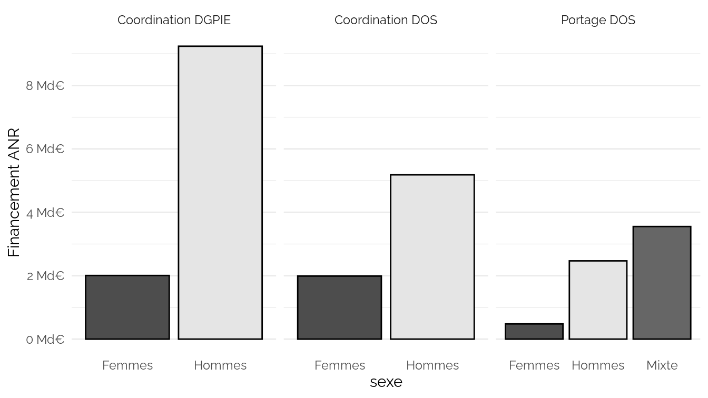

Etude des sexes pour les financements ANR
================

    ## `summarise()` has grouped output by 'prenom'. You can override using the
    ## `.groups` argument.
    ## Joining, by = "prenom"
    ## Joining, by = "Projet.Code_Decision_ANR"
    ## Joining, by = "Projet.Code_Decision_ANR"

<https://www.data.gouv.fr/fr/datasets/anr-02-projets-anr-dgpie-detail-des-projets-et-des-partenaires/>

<https://www.data.gouv.fr/fr/datasets/anr-01-projets-anr-dos-detail-des-projets-et-des-partenaires/>

<https://www.insee.fr/fr/statistiques/2540004?sommaire=4767262>

    ## `summarise()` has grouped output by 'sexe'. You can override using the
    ## `.groups` argument.
    ## `summarise()` has grouped output by 'sexe'. You can override using the
    ## `.groups` argument.

<table>
<thead>
<tr>
<th style="text-align:left;">
sexe
</th>
<th style="text-align:left;">
type
</th>
<th style="text-align:right;">
Nombre.projets
</th>
<th style="text-align:right;">
Financement
</th>
<th style="text-align:right;">
Part.projets
</th>
<th style="text-align:right;">
Part.financement
</th>
</tr>
</thead>
<tbody>
<tr>
<td style="text-align:left;">
Femmes
</td>
<td style="text-align:left;">
Coordination DGPIE
</td>
<td style="text-align:right;">
243
</td>
<td style="text-align:right;">
2007057927
</td>
<td style="text-align:right;">
0.2500000
</td>
<td style="text-align:right;">
0.1784658
</td>
</tr>
<tr>
<td style="text-align:left;">
Hommes
</td>
<td style="text-align:left;">
Coordination DGPIE
</td>
<td style="text-align:right;">
729
</td>
<td style="text-align:right;">
9239117952
</td>
<td style="text-align:right;">
0.7500000
</td>
<td style="text-align:right;">
0.8215342
</td>
</tr>
<tr>
<td style="text-align:left;">
NA
</td>
<td style="text-align:left;">
Coordination DGPIE
</td>
<td style="text-align:right;">
515
</td>
<td style="text-align:right;">
2944256125
</td>
<td style="text-align:right;">
NA
</td>
<td style="text-align:right;">
NA
</td>
</tr>
<tr>
<td style="text-align:left;">
Femmes
</td>
<td style="text-align:left;">
Coordination DOS
</td>
<td style="text-align:right;">
6278
</td>
<td style="text-align:right;">
1988867852
</td>
<td style="text-align:right;">
0.2803930
</td>
<td style="text-align:right;">
0.2773351
</td>
</tr>
<tr>
<td style="text-align:left;">
Hommes
</td>
<td style="text-align:left;">
Coordination DOS
</td>
<td style="text-align:right;">
16112
</td>
<td style="text-align:right;">
5182485805
</td>
<td style="text-align:right;">
0.7196070
</td>
<td style="text-align:right;">
0.7226649
</td>
</tr>
<tr>
<td style="text-align:left;">
NA
</td>
<td style="text-align:left;">
Coordination DOS
</td>
<td style="text-align:right;">
3765
</td>
<td style="text-align:right;">
942972584
</td>
<td style="text-align:right;">
NA
</td>
<td style="text-align:right;">
NA
</td>
</tr>
<tr>
<td style="text-align:left;">
Femmes
</td>
<td style="text-align:left;">
Portage DOS
</td>
<td style="text-align:right;">
2190
</td>
<td style="text-align:right;">
479170135
</td>
<td style="text-align:right;">
0.1152328
</td>
<td style="text-align:right;">
0.0737255
</td>
</tr>
<tr>
<td style="text-align:left;">
Hommes
</td>
<td style="text-align:left;">
Portage DOS
</td>
<td style="text-align:right;">
8342
</td>
<td style="text-align:right;">
2468392100
</td>
<td style="text-align:right;">
0.4389371
</td>
<td style="text-align:right;">
0.3797889
</td>
</tr>
<tr>
<td style="text-align:left;">
Mixte
</td>
<td style="text-align:left;">
Portage DOS
</td>
<td style="text-align:right;">
8473
</td>
<td style="text-align:right;">
3551817299
</td>
<td style="text-align:right;">
0.4458300
</td>
<td style="text-align:right;">
0.5464856
</td>
</tr>
<tr>
<td style="text-align:left;">
NA
</td>
<td style="text-align:left;">
Portage DOS
</td>
<td style="text-align:right;">
7150
</td>
<td style="text-align:right;">
1614946708
</td>
<td style="text-align:right;">
NA
</td>
<td style="text-align:right;">
NA
</td>
</tr>
</tbody>
</table>
<table>
<thead>
<tr>
<th style="text-align:left;">
sexe
</th>
<th style="text-align:right;">
Nombre.projets
</th>
<th style="text-align:right;">
Financement
</th>
<th style="text-align:right;">
Part.projets
</th>
<th style="text-align:right;">
Part.financement
</th>
</tr>
</thead>
<tbody>
<tr>
<td style="text-align:left;">
Femmes
</td>
<td style="text-align:right;">
6521
</td>
<td style="text-align:right;">
3995925779
</td>
<td style="text-align:right;">
0.2791285
</td>
<td style="text-align:right;">
0.2169632
</td>
</tr>
<tr>
<td style="text-align:left;">
Hommes
</td>
<td style="text-align:right;">
16841
</td>
<td style="text-align:right;">
14421603757
</td>
<td style="text-align:right;">
0.7208715
</td>
<td style="text-align:right;">
0.7830368
</td>
</tr>
<tr>
<td style="text-align:left;">
NA
</td>
<td style="text-align:right;">
4280
</td>
<td style="text-align:right;">
3887228710
</td>
<td style="text-align:right;">
NA
</td>
<td style="text-align:right;">
NA
</td>
</tr>
</tbody>
</table>

## Taux porteuse + financement

    ## `summarise()` has grouped output by 'édition'. You can override using the
    ## `.groups` argument.
    ## Joining, by = "édition"

<table>
<thead>
<tr>
<th style="text-align:right;">
édition
</th>
<th style="text-align:right;">
Part.responsables
</th>
<th style="text-align:left;">
sexe.coordinateur
</th>
<th style="text-align:right;">
nb
</th>
<th style="text-align:right;">
financement
</th>
<th style="text-align:right;">
Part.coordinatrices
</th>
<th style="text-align:right;">
Part.financement
</th>
</tr>
</thead>
<tbody>
<tr>
<td style="text-align:right;">
2010
</td>
<td style="text-align:right;">
0.2446024
</td>
<td style="text-align:left;">
Femme
</td>
<td style="text-align:right;">
322
</td>
<td style="text-align:right;">
138713490
</td>
<td style="text-align:right;">
0.2719595
</td>
<td style="text-align:right;">
0.2540838
</td>
</tr>
<tr>
<td style="text-align:right;">
2011
</td>
<td style="text-align:right;">
0.2426141
</td>
<td style="text-align:left;">
Femme
</td>
<td style="text-align:right;">
273
</td>
<td style="text-align:right;">
109854216
</td>
<td style="text-align:right;">
0.2446237
</td>
<td style="text-align:right;">
0.2280711
</td>
</tr>
<tr>
<td style="text-align:right;">
2012
</td>
<td style="text-align:right;">
0.2568321
</td>
<td style="text-align:left;">
Femme
</td>
<td style="text-align:right;">
299
</td>
<td style="text-align:right;">
109483097
</td>
<td style="text-align:right;">
0.2613636
</td>
<td style="text-align:right;">
0.2262396
</td>
</tr>
<tr>
<td style="text-align:right;">
2013
</td>
<td style="text-align:right;">
0.2537406
</td>
<td style="text-align:left;">
Femme
</td>
<td style="text-align:right;">
271
</td>
<td style="text-align:right;">
95650969
</td>
<td style="text-align:right;">
0.2731855
</td>
<td style="text-align:right;">
0.2437904
</td>
</tr>
<tr>
<td style="text-align:right;">
2014
</td>
<td style="text-align:right;">
0.2517822
</td>
<td style="text-align:left;">
Femme
</td>
<td style="text-align:right;">
259
</td>
<td style="text-align:right;">
101820680
</td>
<td style="text-align:right;">
0.2703549
</td>
<td style="text-align:right;">
0.2675300
</td>
</tr>
<tr>
<td style="text-align:right;">
2015
</td>
<td style="text-align:right;">
0.2556188
</td>
<td style="text-align:left;">
Femme
</td>
<td style="text-align:right;">
250
</td>
<td style="text-align:right;">
94646192
</td>
<td style="text-align:right;">
0.2670940
</td>
<td style="text-align:right;">
0.2637560
</td>
</tr>
<tr>
<td style="text-align:right;">
2016
</td>
<td style="text-align:right;">
0.2558329
</td>
<td style="text-align:left;">
Femme
</td>
<td style="text-align:right;">
311
</td>
<td style="text-align:right;">
117551588
</td>
<td style="text-align:right;">
0.2720910
</td>
<td style="text-align:right;">
0.2742629
</td>
</tr>
<tr>
<td style="text-align:right;">
2017
</td>
<td style="text-align:right;">
0.2691116
</td>
<td style="text-align:left;">
Femme
</td>
<td style="text-align:right;">
363
</td>
<td style="text-align:right;">
134291794
</td>
<td style="text-align:right;">
0.2858268
</td>
<td style="text-align:right;">
0.2771953
</td>
</tr>
<tr>
<td style="text-align:right;">
2018
</td>
<td style="text-align:right;">
0.2802419
</td>
<td style="text-align:left;">
Femme
</td>
<td style="text-align:right;">
368
</td>
<td style="text-align:right;">
138203976
</td>
<td style="text-align:right;">
0.2877248
</td>
<td style="text-align:right;">
0.2730663
</td>
</tr>
<tr>
<td style="text-align:right;">
2019
</td>
<td style="text-align:right;">
0.2840355
</td>
<td style="text-align:left;">
Femme
</td>
<td style="text-align:right;">
435
</td>
<td style="text-align:right;">
157745132
</td>
<td style="text-align:right;">
0.3076379
</td>
<td style="text-align:right;">
0.3063391
</td>
</tr>
<tr>
<td style="text-align:right;">
2020
</td>
<td style="text-align:right;">
0.2913276
</td>
<td style="text-align:left;">
Femme
</td>
<td style="text-align:right;">
480
</td>
<td style="text-align:right;">
174176317
</td>
<td style="text-align:right;">
0.3045685
</td>
<td style="text-align:right;">
0.2913496
</td>
</tr>
<tr>
<td style="text-align:right;">
2021
</td>
<td style="text-align:right;">
0.3108343
</td>
<td style="text-align:left;">
Femme
</td>
<td style="text-align:right;">
696
</td>
<td style="text-align:right;">
284903018
</td>
<td style="text-align:right;">
0.3276836
</td>
<td style="text-align:right;">
0.3122900
</td>
</tr>
<tr>
<td style="text-align:right;">
2022
</td>
<td style="text-align:right;">
0.3175336
</td>
<td style="text-align:left;">
Femme
</td>
<td style="text-align:right;">
564
</td>
<td style="text-align:right;">
252955716
</td>
<td style="text-align:right;">
0.3347181
</td>
<td style="text-align:right;">
0.3364597
</td>
</tr>
</tbody>
</table>

